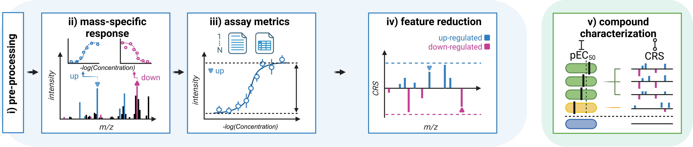

# M²ara - MALDI MS Bioassays Evaluation and Classification App

M²ara is a software tool to facilitate the exploration of metabolomic responses in complex matrix-assisted laser desorption/ionization mass spectrometry (MALDI MS) bioassays. The app is intented for the evaluation of metabolomic drug actions by using the mass-to-charge ratios of hundreds of metabolites and it is particularly useful in defining novel pharmacodynamic biomarkers for high-throughput applications.

M²ara is based on the R package [MALDIcellassay](https://github.com/CeMOS-Mannheim/MALDIcellassay) (published in [Unger et. al. 2021](https://www.nature.com/articles/s41596-021-00624-z), Nature Protocols) and extends its capabilities with a GUI and adds helpful features like clustering of curves, PCA analysis as well as the Curve Response Score (CRS) which enables fast screening for molecules regulated by drug treatment.



## How to use

This application simplifies the analysis of Molecular High Content Screening (MHCS) MALDI-TOF MS assay data and the evaluation of complex drug actions. After your data has been loaded, you can adjust settings as needed and start the processing. From here, you can analyze your data by selecting entries in the data table, visually inspect and rank mass features using the Curve Response Score (CRS) fingerprints, and save the curve fit and peak profile of your chosen *m/z* value. 

This app is specifically designed for use with Bruker flex series raw data but also features support for mzML.

For more detailed information please take a look at the [Manual](manual.md) that is also available inside the app.

## How to install 

### R

Clone the GitHub repository to your local machine (please make sure to have R installed) and start the app by sourcing the `app.R` file.

```bash
git clone https://github.com/CeMOS-Mannheim/M2ara.git
```

```R
# install all packages needed
source("install_packages.R")

# run app
source("app.R")
```

### Docker
Install the [docker container](https://hub.docker.com/repository/docker/thomasenzlein/m2ara), run it and access `localhost:3838` to interact with the app.
Don't forget to change the path `c:/path/to/massSpecData` to your data so that it can be mounted when running the container.

```bash
docker pull thomasenzlein/m2ara:main
```

```bash
docker run -p 3838:3838 -v  c:/path/to/massSpecData:/mnt thomasenzlein/m2ara:main
```

### Stand-alone installer for Windows
Use the stand-alone installer (Windows only, no R installation needed).
The installer can be downloaded [here](https://github.com/CeMOS-Mannheim/M2ara/releases/download/1.1/M.ara_1.1.exe).

## Example data
To test the app please use the example data on [FigShare](https://dx.doi.org/10.6084/m9.figshare.25736541). 

### Unger2020_OATP2B1_inhibition_mzML.zip

The file contains mzML data (converted from Bruker Flex using MSConvert) originally published in Unger, et. al., 2020.

To replicate the results shown use the following parameters:

- under Settings set File Format to mzML
- set Concentration unit to nM
- set Normalization/re-calibration *m/z* to 354.1418 (D4-E3S, [M-H]-)
- set recalibration tolerance to 0.1 Da
- set normalization to *m/z*
- activate smoothing and baseline removal
- set Aggregation method to mean
- set SNR to 3
- set alignment to 0 mDa (no alignment)
- set binning tolerance to 100 ppm
- select the folder `mzML` (parent folder of the mzML files) from the .zip file, please make sure that no other files are in this folder.

The target *m/z* is 349.11 (E3S, [M-H]-) the pIC50 value should be 6.1.

### Weigt2018_BCR-ABL_inhibition_Dasatinib_BrukerFlex.zip

The file contains data in the Bruker Flex format originally published in Weigt, et. al., 2018.

To replicate the results shown use the following parameters:

- under Settings set File Format to Bruker Flex
- set Concentration unit to µM
- set Normalization/re-calibration *m/z* to 760.5851 (PC(34:1) [M+H]+)
- set recalibration tolerance to 0.1 Da
- set normalization to TIC
- activate smoothing and baseline removal
- set Aggregation method to mean
- set SNR to 3
- set alignment to 0 mDa (no alignment)
- set binning tolerance to 100 ppm
- select the the folder `curve` from the .zip file, make sure no other files/folders are present.

The target is *m/z* 826.5722 (PC(36:1) [M+K]+) and *m/z* 616.1767 (Heme B [M+H]+) the pIC50 values should be 9.5 and 9.7.

