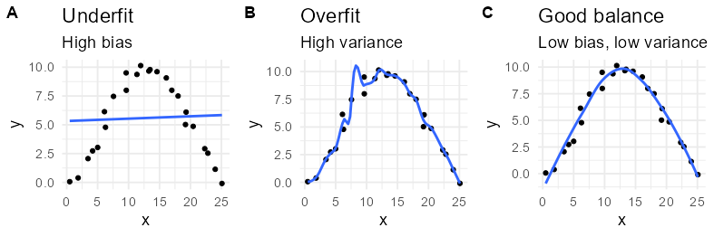

### LASSO regression

***

LASSO regression **(least absolute shrinkage and selection operator)** is a method that uses regularization (L1-norm) as well as feature selection to enhance the predictive value and interchangeability of the resulting model (from more information see original publication by [Robert Tibshiran 1996](https://www.jstor.org/stable/2346178). 

#### Bias and variance

When the performance of a model is discussed two aspects of prediction errors should be considered: Bias and variance. There will always be some kind of trade-off between a models ability to minimize bias and variance. 
When building a model, two things have to avoided: Over-fitting or under-fitting the model.

#### Least-squares regression

A ordinary least squares (OLS) fit of a single independent variable ($x$), tries to find the coefficient ($m$) as well as the y-axis intercept ($b$) for the following equation:

$$ y = x * m + b $$

OLS regression is using the following loss function $L$:

$$ \underset{m}{\operatorname{argmin}} = L(m) $$
$$ L  = ||mx - b||_2 $$

When multiple regression using a OLS fit is applied to a high dimensional data set (high number of features, e.g. *m/z*-values) all coefficients ($m$) will be non-zero.
This means that the model considers all *m/z*-values at least somewhat important. 
This has two major drawbacks:

1. The model will tend to over fit the data.

2. Although the coefficients could be used to rate the importance of single *m/z*-features on the model output, this is typically not a good idea because of the high complexity of the model.

#### LASSO regression

LASSO regression solves this problem by introducing a L1-norm: A linear  ``penatly``-term $\lambda$.
This leads to the following loss function $L$ for LASSO regression:

$$ L  = ||mx - b||_2 + \lambda||m||_1 $$

By adding the L1-norm ($\lambda||m||_1$) to the loss function, high coefficients are penalized, which is why the model will use smaller coefficients than a OLS model which leads to a lower tendency to over fit the data and will also lead to *m/z*-features with a coefficient of zero, effectively ignoring this feature in the model completely.

Increasing the penalty $\lambda$ will lead to more features with a coefficient of zero and therefore to a less complex and often more robust model. At the same time, increasing $\lambda$ will also increase the bias of the model while decreasing the variance (see figure below).

To sum up the most important points:

- At $\lambda = 0$, no features (*m/z*-values) are eliminated. The estimate is equal to the one found by OLS regression.
- At increasing $\lambda$ more and more features are eliminated (by setting their coefficients $m$ to zero).
- At $\lambda = \infty$ all features will be eliminated.
- As $\lambda$ increases, variance decreases.
- As $\lambda$ increases, bias increases.

#### Tuning

To tune a LASSO model the optimal penalty ($\lambda$) needs to be selected. In this implementation a 5-fold bootstrapping is performed and the models performance (R²-metric) is rated at penalties ranging from $1*10^{-5}$ to $0$. The penalty resulting in the most simple model that is within one standard error of the numerically optimal results according to the "one-standard error rule" [Breiman et al. 1984](https://doi.org/10.1201/9781315139470) is chosen.
The penalty slider is then automatically set to the optimal value and can always be reset to this value by using the button below it. 
Still a higher (or lower) penalty can be selected to get a better fit to the data (at risk of over fitting) or to get a simpler model with a lower R².

#### Scope of usage

In the context of this app that is intended to identify biomarkers upon treatment of cells with increasing concentrations of a given compound the LASSO regression adds another "lens" onto the data. The EC50-curve fitting is a purely univariate method and does not consider any interactions between signals. So it can be considered a "strictly local lens" onto the data. The PCA is a unsupervised multivariate method but simply tries to maximize the explained variance of the data (which is not necessarily the same as the part of the data that was actually changed by the treatment). In this regards the PCA is a "global lens" onto the data. LASSO regression is right between this two extremes. It is a supervised multivariate method that still tries to focus more on "local trends" then in considering global measures about the data (unlike PCA which tries to maximize explained variance).
As said, all of these tools are just lenses onto the same data. Each will tell a slightly different story and in the end the individual goal of the data analysis will help to choose the right persepective (or lens) onto the data.
