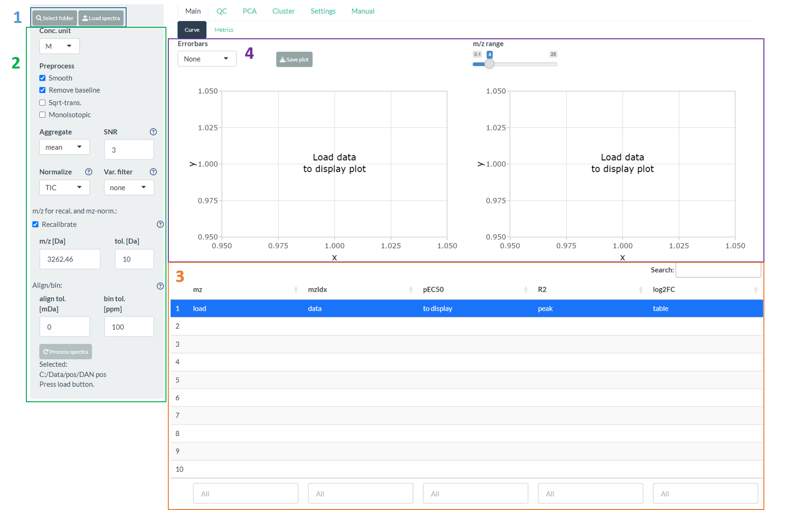
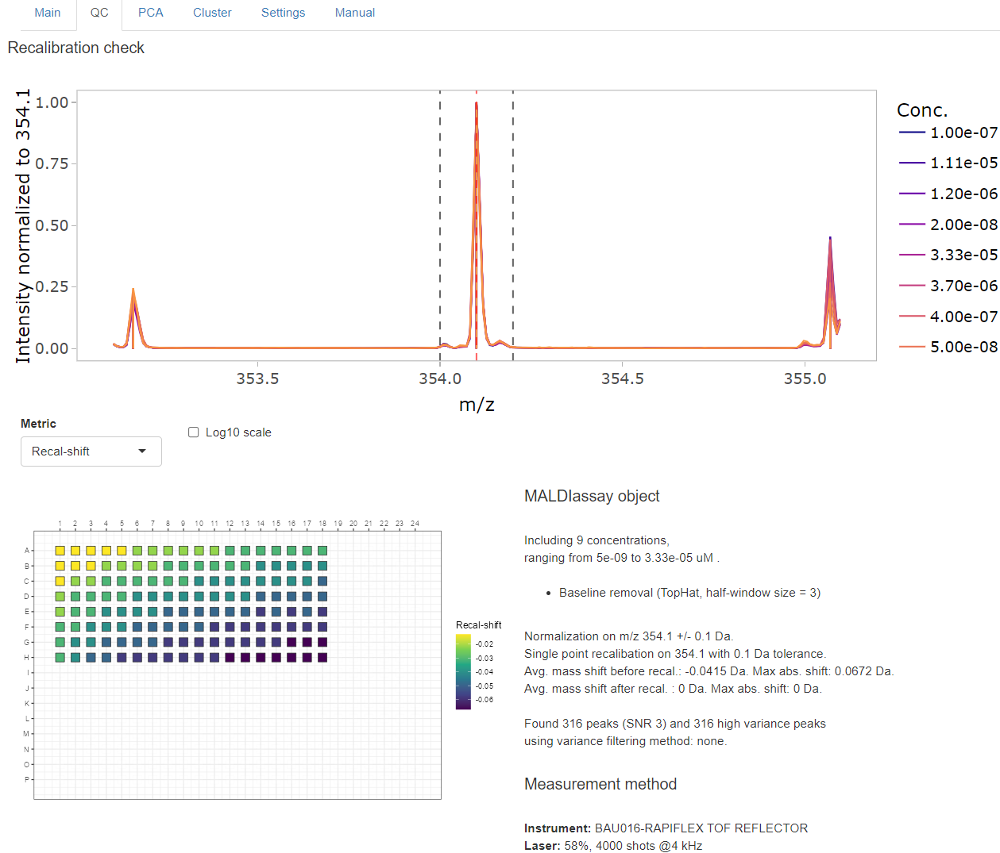
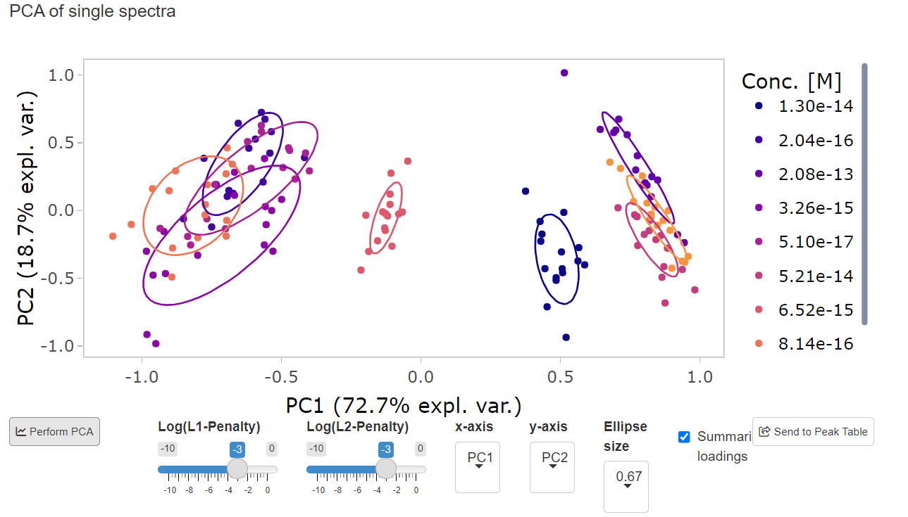
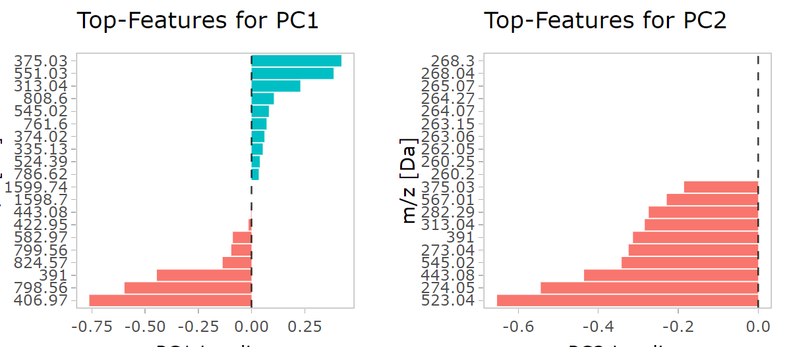

```{r setup, include=FALSE}
knitr::opts_chunk$set(echo = TRUE)
```

# M2ara Manual

This is **M2ara**, a shiny application based on the R-package `MALDIcellassay` which can be found at [GitHub](https://github.com/CeMOS-Mannheim/MALDIcellassay). It is intended to detect biomarkers in cell-based MALDI assays by generating dose-response curves. The methods used were originally published by [Weigt et. al., 2019](https://www.sciencedirect.com/science/article/pii/S2451945619302053?via%3Dihub) and the R-package implementing the methods was published together with the Nature Protocols publication of [Unger et. al., 2021](https://www.nature.com/articles/s41596-021-00624-z).

This manual describes some of the details of the inner-workings of the `MALDIcellassay`-package and how this shiny application (**M2ara**) is supposed to be used.

The following features were already part of `MALDIcellassay`:

-   pre-processing though the `MALDIquant`-package
-   re-calibration to a single *m/z* (single point-re-calibration)
-   normalization to a single *m/z*
-   fitting curves to the data using the `nplr`-package

**M2ara** adds the following features:

-   graphical user interface
-   interactive data exploration
-   support for [mzML](#mzml) data \*
-   calculation of quality metrics (*Z'*, *V'*, *log2FC*, *CRS*) \*
-   feature ranking by metric \*
-   principle component analysis (PCA)
-   curve clustering
-   outlier detection \*

\* The features marked with a asterisks were re-implemented to `MALDIcellassay`.

# General information

The blue question mark icons (`r icon("question-circle")`) throughout the application can be clicked and provide further information on the specific settings.

# Requirements to the raw data {#requirements-to-the-raw-data}

For best results, a concentration curve should consist of at least 7 points (better 9 points).
To calculate all necessary [Scores](#scores) there should be at least two replicates (better 4) per concentration.

For the curve fitting to work all spectra must have an associated concentration. This concentration can be supplied in two ways: 
1. as filename (see below) 
2. as mapping file (\*.txt) containing the concentrations of the spectra in the right order one per line.

## Concentration mapping file 
The mapping file can be uploaded before loading the spectra using Settings -\> Conc. mapping. This method can be used for [Bruker](#bruker) and [mzML](#mzml). As said the concentrations need to be in the right order, one concentration per line and the number of concentrations must match the number of spectra. Also please don't use any units or other characters (which cant be converted to numbers).

## Bruker Flex format (\*.fid) {#bruker}

This application supports Bruker flex raw data as generated by instruments of the Bruker-Flex series (e.g. RapiFleX, UltraFleX, AutoFleX). At the moment there is no support for timsTOF or SolariX data directly but import via [mzML](#mzml) is possible.

The organization of an experiment in the Flex format needs to be as follows:

```         
20191209/       name of the experiment
├── 0/          1st Concentration of compound / Name of Sample 1
│   ├── 0_O13/  Measurement replicate for sample 1
│   ├── 0_O14/  Measurement replicate for sample 1
│   ├── 0_P13/  Measurement replicate for sample 1
│   └── 0_P13/  Measurement replicate for sample 1
├── 0.04/       2nd Concentration of compound / Name of Sample 2
│   ├── 0_O15/  Measurement replicate for sample 2
│   ├── 0_O16/  Measurement replicate for sample 2
│   ├── 0_P15/  Measurement replicate for sample 2
│   └── 0_P16/  Measurement replicate for sample 2
├── 0.12/       3rd Concentration of compound / Name of Sample 
etc.
```

Briefly: Each spectrum has to reside in a folder which is named according to the concentration used to treat the cells in the respective sample. The number of measurement replicates per concentration is unlimited (should typically be at least four to compensate for artifacts from e.g. matrix heterogeneity or preparation).

## mzML {#mzml}

For mzML-import the mzML files need to be named with the corresponding concentration used for treatment. Please put all technical replicates for a given concentration into the same mzML file.

```         
20191209/       name of the experiment
├── 0.mzML      1st Concentration of compound including all replicates
├── 0.04.mzML   2nd Concentration of compound including all replicates
├── 0.12.mzML   3rd Concentration of compound including all replicates
etc.
```

# Step-by-step {#curve-screen}

```{r, echo=FALSE, out.width="66%", fig.cap="Interface of the app"}

```

1.  Click on the **Select folder**-button (1, see figure above) and select a folder containing your experiment (see [Requirements to the raw data](#requirements-to-the-raw-data)). The following dialog is displayed:\
    `r knitr::include_graphics("figures/selectFolder.png")`

2.  Click on the **Load spectra**-button (1) to import your spectra. Depending on the size of the experiment, loading takes 30s - 3 minutes.

3.  You may now change any of the settings in the sidebar (2). Once your are satisfied click the **Process spectra**-button on the bottom of the sidebar.

4.  Analyze your data by clicking on entries in the table on bottom left (3). The plots for the curve and the peaks will change accordingly (4). You may want to display error bars or use the slider to change the displayed *m/z*-range (aka zoom) in the plot displaying the peaks. Note, you do not need to re-upload your data if you want to play with the settings. Just click the **Process spectra**-button again to re-do the calculations and after a short time your results will be updated.

5.  If you want to save the curve fit and peak profile of a given *m/z*-value you can click the download button below the peak table to save your results as \*.csv.

# Analysis pipeline

The analysis pipeline consist of the following steps (see figure below for a graphical overview):

1.  The folder of the experiment is selected (see [Requirements to the raw data](#requirements-to-the-raw-data))
2.  The data is loaded. Note, all steps after step 2 will use the data currently loaded. This means that there is no need to re-load the data if any changes are made to the settings.
3.  `Preprocessing` is applied to the raw data. This includes (in this order) `Smoothing` using "Savitzky Golay" method, `Baseline` substraction using "Top Hat" method, `Square-root transformation` of the intensity, `Detect peaks` of raw (single) spectra.
4.  The peaks are used to do the (single-point) `recalibration` on the single (continuous) spectra additionally the peaks are also recalibrated themselfs.
5.  The recalibrated single peaks are used to determine the normalization factor (does only apply for the `mz` normalization method). The `normalization` is applied to the single (continuous) spectra.
6.  The single peaks are used to do the alignment of the single (continuous) spectra.
7.  `Average spectra`: The single (continuous) spectra are used for averaging the measurement replicates for each concentration.
8.  `Detect peaks` of average spectra.
9.  `Intensity matrix`: The peaks of the average spectra are transformed into a matrix with columns representing *m/z* values and rows representing concentrations whereas cells contain the respective intensity.
10. `Varience filtering` is applied.
11. `Curve fitting` is performed.
12. `Quality metrics` are calculated (*V'*, *Z'*, *SSMD*, *Log2FC*, *CRS*).
13. The peaks can be selected in the `Peak table`.
14. The respective dose-response curve as well as the peak profile is visualized and might be saved.

```{r, echo=FALSE, out.width="66%", fig.cap="Schematic outline of the analysis workflow"}
knitr::include_graphics("figures/pipeline.png")
```

# Individual screens

## Main Tab

### Curve subtab

The main [Curve](#curve-screen) screen is intended for a univariate analysis in a peak-by-peak manner.

On the upper right fitted curves and individual data points are shown (error bars showing the standard deviation or standard error of the mean can be displayed using the drop down menu). This plot can be used to judge the goodness of fit and the general curve shape manually.

The upper left show's a zoom-in to the corresponding individual peaks. The level of zoom can be adjusted to either display details of the peaks or investigate the surroundings of a single e.g. to judge if it is part of a isotopic envelope.

Below the two plots the peak table is shown. Here all found signals as well as all metrics are displayed. The two upper plots will change if a signal is selected.

#### Scores

**M²ara** comes with a variety of helpful scores/metrics that are meant to help judging the quality of response curves.

##### Modified Z':

In pharmaceutical industry and research, the quality of a bioassay is assessed by common metrics that rely on a negative and positive control [Zhang et al., 1999](https://pubmed.ncbi.nlm.nih.gov/10838414/), [Iversen et al., 2006](https://doi.org/10.1177/1087057105285610), [Ravkin et al., 2004](http://www.ravkin.net/articles/5322-7.pdf) . However, in order to be able to explore unknown cellular drug effects in whole-cell MALDI MS bioassays and to classify m/z features as either up-, down- or non-regulated, characteristic measures need to be deduced from the concentration response data directly. First, to assess the variability within the assay data relative to the effective window size, a modified form of the *Z’* factor [Zhang et al., 1999](https://pubmed.ncbi.nlm.nih.gov/10838414/), defined by 

$$
Z'_{mod.} = 1-\frac{3*(\sigma_u+\sigma_l)}{|\mu_u-\mu_l|}
$$ 

is implemented into **M²ara**. The modified *Z'* score helps to make a judgment about the distance of the means ( $\mu$ , more is better) and standard deviation ( $\sigma$ , less is better) of the upper ( $_u$ ) and lower ( $_l$ ) end of the curve.

##### Modified V':

The modified *V'* [Ravkin et al., 2004](http://www.ravkin.net/articles/5322-7.pdf) is introduced to assess the root-mean-square deviation of the response data relative to the log-logistic model fit, determined by 

$$
V'_{mod.}=1-6*\frac{\sigma_f}{|a_u-a_l|} 
$$ 

with 

$$
\sigma_f=\sqrt{\frac{1}{N}\sum(f_{exp}-f)^2}
$$

where $\sigma_f$ is the standard deviation of the residuals of the 4-parameter non-linear regression model *f* calculated from the experimental (exp) data and the model. Hereby, the modified *V'* factor reflects the goodness of the fit and thus the variance within all data points described by the model.
In short: *V'* focuses more on the goodness of fit of the curve to the data points.

##### Log2-Fold-Change

The $Log_2FC$ denotes the magnitude i.e. effect size of a response. It is defined as:

$$
Log_2 FC =log_2\frac{a_u}{a_l}
$$
where $a_u$ and $a_l$ the upper and lower asymptotes.
In short: The $Log_2FC$ gives the raw (no variation of data points considered) difference between the upper and lower part of the curve.

##### SSMD

The Strictly Standardized Mean Difference (*SSMD*), is implemented [Bray and Carpenter 2004](https://pubmed.ncbi.nlm.nih.gov/23469374/); [Zhang et al., 2007](https://doi.org/10.1016/j.ygeno.2006.12.014), with:

$$
SSMD = \frac{|\mu_l-\mu_u|}{\sqrt{\sigma^2_u+\sigma^2_l}}
$$
In short: The *SSMD* gives the difference between the upper and lower part of the curves in units of standard deviation. Or in other words, it gives a weigthed differences.

##### Curve-repsonse-score (CRS)

$$
CRS=
\begin{cases}
\frac{fcScore+vScore+zScore}{3}*100,\\
0 \quad for \quad Z'_{mod.}<-0.5 \quad or \quad V'_{mod.}<-0.5
\end{cases}
$$
with

$$
fcScore=
\begin{cases}
1 \quad for \quad |log_2FC| > log_2FC_{max}\\
\frac{|log_2FC|}{log_2FC}
\end{cases}
$$
and
$$
vScore=V'_{mod.}
$$
and
$$
zScore=
\begin{cases}
1 \quad for \quad Z'_{mod.}>0.5\\
\frac{Z'_{mod.}}{0.5} \quad for \quad 0.5 > Z'_{mod.}>-0.5
\end{cases}
$$
The *CRS* combines three measures used to describe the quality of a response curve, the effect size defined as $Log_2FC$ and incorporated in the fcScore, the $V'_{mod.}$ factor being equal to the vScore and the $Z'_{mod.}$ factor used in the definition of the zScore. In the fcScore, the $Log_2FC$ is normalized by and thresholded at $Log_2FC_{max}=2.59$ . The factor is chosen to not overrate features that exhibit substantial changes. The restriction of the $Z'_{mod.}$ factor to the zScore is made due to the common interpretation of the *Z’* factor (Zhang, Chung and Oldenburg 1999). For $Z'_{mod.}>0.5$ a bioassay is said to be excellent, since for $\sigma_l=\sigma_u$ a value of 0.5 is equivalent to a separation of 12 standard deviations between $\mu_u$ and $\mu_l$ . Accordingly, a value of -0.5 is equivalent to a separation of 3 standard deviations between  $\mu_u$ and $\mu_l$ for $\sigma_l=\sigma_u$ . The rather moderate lower threshold is in particular of importance for MALDI MS-based bioassay exhibiting a relatively high variance in the data. 

### Metrics subtab

The metrics screen enables to visualize different metrics (*Z'*, *V'*, *SSMD*, *logFC*, *CRS* as well as pEC50, etc.) as a function of **m/z**. The direction of the peaks (up or down) highlights the direction of regulation (if the intensity of the signal increases or decreases with the concentration). It is therefor useful to get a fast overview of the whole data set. The different metrics concentrate on different aspects of the quality of the curve.

## QC tab

The top part of the OC tab focuses on the (potential) peak used for re-calibration and enables the user to inspect the alignment of the (average) spectra per concentration.

The lower left part shows different metrics (both assay quality metrics like *Z'*, *V'*, *CRS* and MALDI parameters like total ion current as well as re-calibration shifts and PCA loadings) per spot in a target plate view. **This functionality is currently only featured for Bruker raw data. And wont be visible with the `mzML` input file format selected.**

The lower right shows processing (and in case of Bruker data also some measurement meta data) as a summary.

```{r, echo=FALSE, out.width="66%", fig.cap="Example of QC-tab"}

```

## PCA tab

A PCA (Principle component analysis) enables a multivariate view to the data by dimensional reduction. Although, on its own its hard to identify biomarkers/regulated signals with it, the PCA is highly useful to judge the general concentration-dependent differences introduced by the treatment. A high separation of the different concentrations shows that some multivariate effects are in place were-as a low separation hints at either low effects overall or effects that are unique to some single (and most likely rather small) peaks. This is why the PCA can be a nice addition to the univariate analysis featured on the [Curves](#curve-screen)-screen The PCA can be generated by clicking on the `Perform PCA`-Button.

```{r, echo=FALSE, out.width="66%", fig.cap="PCA scores plot"}

```

The drop down menu's adjust the PC (Principle component) shown on the x- and y-axis. The sliders adjust the L1 (Lasso) and L2 (Ridge) penalty. A high L1 penalty will lead to a sparse (low amount of non-zero loading's) representations of the data, making it easier to identify factors (signals) that influence the separation shown in the scores plot. If the L1 penalty is set to 0 a normal (dense) PCA will be generated.

The loading's can used to identify peaks that have a high influence to the scores of the PCA.

```{r, echo=FALSE, out.width="66%", fig.cap="PCA loadings plot"}

```

Using the `Summarise loadings`-button either the summarized (see figure above) or full (in a loadings vs **m/z** spectrum) loading's can be visualized. Using the `Send to peak table`-button the numeric loading's can be send to the peak table on the [Curve](#curve-screen)-screen to investigate easily if the overlap with univariate signals of interest (high scores in *Z'*, *V'* or *CRS*) or if the represent a separate regulation cause by many smaller changes not strong enough to lead to high scores on their own.

## Cluster tab

The cluster tab enables to cluster curves based on their shape to enable to detect signals of interest that follow a similar direction as one (or many) target signals.

```{r, echo=FALSE, out.width="66%", fig.cap="Curve clustering"}
knitr::include_graphics("figures/clustering_curves.png")
```

On the right the individual (black) curves for all signals are shown together with their average curves trajectory (colored). The left plot shows all trajectories in direct comparison.

Using the slider the user needs to adjust the number of clusters to a reasonable value. The clustering metrics shown below can help but in the end non of these metrics is perfect and the clustering might work better for some data sets then for other. It is intended not as an analytic tool but rather as a helper to find curves with similar trajectories (e.g. identify all signals were the intensity goes up or down with increasing concentration). So the number of clusters should be selected in a way that the average trajectories line up as good as possible with the individual curves.

```{r, echo=FALSE, out.width="66%", fig.cap="Clustering metrics"}
knitr::include_graphics("figures/clustering_metrics.png")
```

## Settings tab

```{r, echo=FALSE, out.width="33%", fig.cap="Settings tab"}
knitr::include_graphics("figures/settings.png")
```

The `File format`-menu can be used to select between Bruker raw data of mzML format (see [Requirements to the raw data](#requirements-to-the-raw-data)).

The `Conc. mapping` upload button enables the upload of a mapping file containing one concentration for each spectrum. It needs to be in the \*.txt-format and needs to contain one concentration (dont include units!) per line, one for each spectrum. The file needs to be uploaded before the spectra are loaded using the button on the sidebar if the mapping should be used.

The `Peak window size` and `Peak method` setting enables to change the peak detection. Usually a `Peak window size` of 20 and the *SuperSmoother* method should lead to good results. Sometimes, especially if a small peak is close to a large one, this small peak might not be detected. In this cases the `Peak window size` can be decreased or if this is still not enough the *MAD* peak detection method can be chosen. Please note that both will lead to much more signals being considered as valid peaks, so it makes sense to increase SNR at the same time.

The `Exclude empty spectra` setting will exclude spectra that don't contain any signals.

### Saving processing parameters

To save results for a later usage the app includes the option to save all relevant processing parameters. This can be done by clicking: `Settings` -\> `Save settings`. If also the path to the data should be saved this needs to be after setting the directory but before loading the spectra.

A file called `settings.csv` is saved in the working directory containing all parameters.

If such a file is found at the start-up of the app, the parameters will be loaded as defaults.

As processing is typically fast, this is a more efficient (time & disk-space) process then to save the complete app-state including spectra and calculated values.

## Save fitting parameters

The curve fitting in the app is internally performed by the [nplr-package](https://github.com/fredcommo/nplr) that used the Richardson Formula for Logistic regression:

$$
y=\frac{B+(T-B)}{(1+10^{scal*(xmid-x)})^s}
$$

The parameters used for each single *m/z* can be downloaded from the app under `Settings` -\> `Save fitting param.`.
