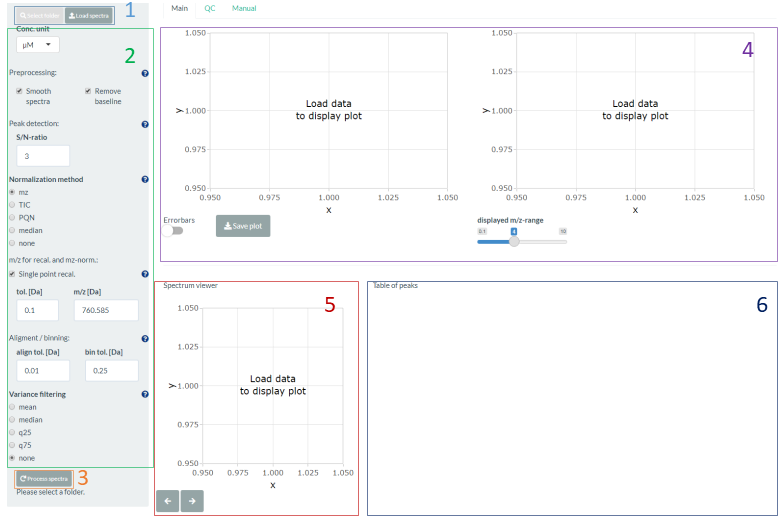
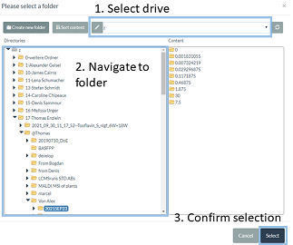
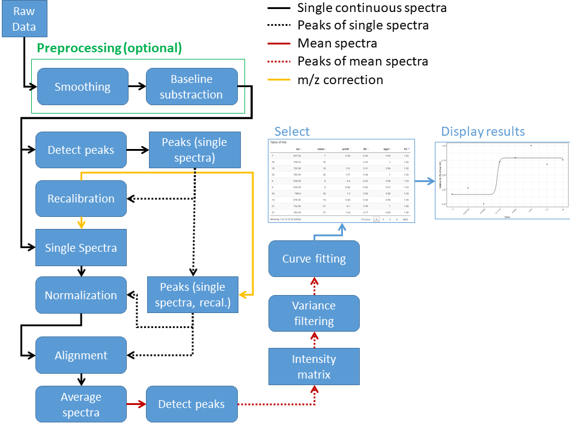

### MALDIcellassay Manual

This is a shiny application based on the R-package ``MALDIcellassay`` which can be found at [GitHub](https://github.com/CeMOS-Mannheim/MALDIcellassay). 
It is intended to detect biomarkers in cell-based MALDI assays by generating dose-response curves.
The methods used were originally published by [Weigt et. al., 2019](https://www.sciencedirect.com/science/article/pii/S2451945619302053?via%3Dihub) and the R-package implementing the methods was published together with the Nature Protocols publication of [Unger et. al., 2021](https://www.nature.com/articles/s41596-021-00624-z).


This manual describes some of the details of the inner-workings of the ``MALDIcellassay``-package and how this shiny application is supposed to be used.

#### General information
The blue question mark icons in the sidebar at the left side can be clicked and provide further information on the specific settings. 

#### Requirements to the raw data
This application currently supports Bruker flex raw data as generated by instruments of the Bruker-Flex series (e.g. RapiFleX, UltraFleX, AutoFleX). At the moment there is no support for timsTOF or SolariX data.

The organization of an experiment needs to be as follows:

```
20191209/       name of the experiment
├── 0/          1st Concentration of compound / Name of Sample 1
│   ├── 0_O13/  Measurement replicate for sample 1
│   ├── 0_O14/  Measurement replicate for sample 1
│   ├── 0_P13/  Measurement replicate for sample 1
│   └── 0_P13/  Measurement replicate for sample 1
├── 0.04/       2nd Concentration of compound / Name of Sample 2
│   ├── 0_O15/  Measurement replicate for sample 2
│   ├── 0_O16/  Measurement replicate for sample 2
│   ├── 0_P15/  Measurement replicate for sample 2
│   └── 0_P16/  Measurement replicate for sample 2
├── 0.12/       3rd Concentration of compound / Name of Sample 
etc.
```
Briefly: Each spectrum has to reside in a folder which is named according to the concentration used to treat the cells in the respective sample. The number of measurement replicates per concentration is unlimited (should typically be at least four to compensate for artifacts from e.g. matrix heterogeneity or preparation).

#### Step-by-step



1. Click on the **Select folder**-button (1, see figure above) and select a folder containing your experiment (see chapter **Requirements to the raw data**).
    - In the bottom of the sidebar on the left the text will change to *Selected: /your/path/ Press load button.*
2. Click on the **Load spectra**-button (1) to upload your spectra. The following dialog is displayed:  
  
This may take some time. If your experiment is really big it can take up to 3 minutes. Usually it should be finished within 30 seconds.
    - The text in the sidebar will change again once the spectra are loaded: *Loaded: /your/path/ Press process button.*
3. You may now change any of the settings in the sidebar (2). Once your are satisfied click the **Process spectra**-button (3).
    - Wait till the text in the sidebar changes again and the plots are displayed
4. Analyze your data by clicking on entries in the table on bottom left (6). The plots for the curve and the peaks will change accordingly (4). You may want to display error bars or use the slider to change the displayed *m/z*-range (aka zoom) in the plot displaying the peaks.
The spectrum on the bottom-left (5) shows the global mean and is intended for orientation in the dataset. You can zoom it by drawing a rectangle. By using the arrow buttons you can also switch to the average spectra of the concentrations used.
    - Note, you do not need to re-upload your data if you want to play with the settings. Just click the **Process spectra**-button (3) again to re-do the calculations and after a short time your results will be updated.
5. If you want to save the curve fit and peak profile of a given *m/z*-value you can click the download button (4) to do so.


#### Analysis pipeline

The analysis pipeline consits of the following steps (see figure for a graphical overview):

1. The folder of the experiment is selected (see chapter "Requirements to the raw data")
2. The data is loaded 
  - Note, all steps after step 2 will use the data currently loaded. This means that there is no need to re-load the data if any changes are made to the settings.
3. ``Preprocessing`` is applied to the raw data.
  - ``Smoothing`` using "Savitzky Golay" method.
  - ``Baseline`` substraction using "Top Hat" method.
4. ``Detect peaks`` of raw (single) spectra.
5. The peaks are used to do the (single-point) ``recalibration`` on the single (continuous) spectra additionally the peaks are also recalibrated themselfs.
6. The recalibrated single peaks are used to determine the normalization factor (does only apply for the ``mz`` normalization method). The ``normalization`` is applied to the single (continuous) spectra.
7. The single peaks are used to do the alignment of the single (continuous) spectra.
8. ``Average spectra``: The single (continuous) spectra are used for averaging the measurement replicates for each concentration.
9. ``Detect peaks`` of average spectra.
10. ``Intensity matrix``: The peaks of the average spectra are transformed into a matrix with columns representing *m/z* values and rows representing concentrations whereas cells contain the respective intensity. 
11. ``Varience filtering`` is applied.
12. ``Curve fitting`` is performed.
13. The peaks can be selected in the ``Table of peaks``.
14. The respective dose-response curve as well as the peak profile is visualized and might be saved.



